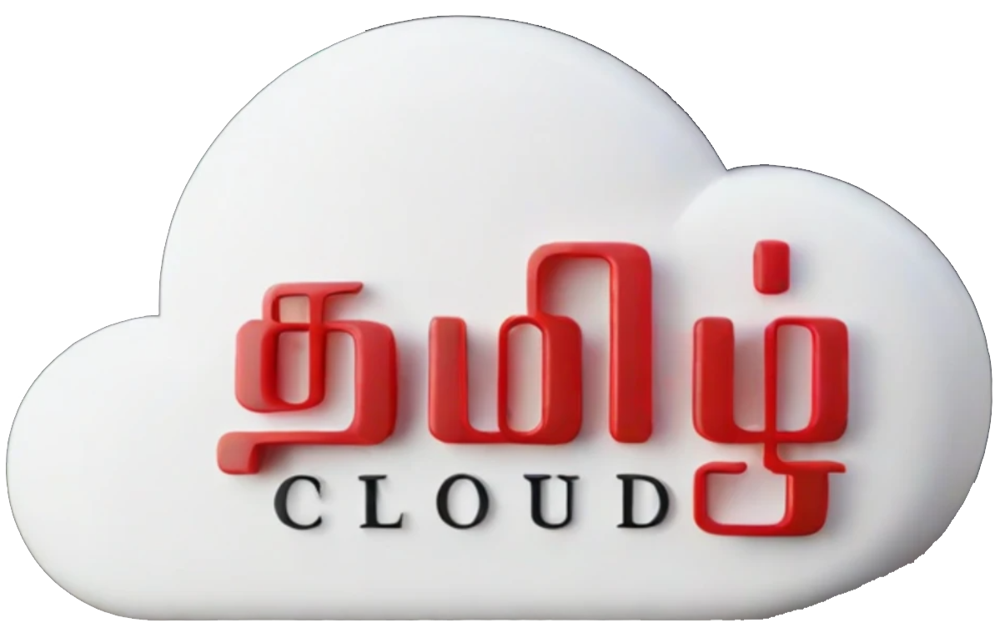

# Tamil Cloud Community

  

## About Us

Tamil Cloud is a community where cloud technology enthusiasts come together to share their knowledge and experiences in their regional language. This community is dedicated to providing cloud knowledge and resources in Tamil, helping enthusiasts learn and grow in the field of cloud computing.

## Resources

Here are some valuable resources shared by our community

- **Cloud Tutorials** Step-by-step guides on various cloud services.
- **Webinars** Recorded webinars on cloud technologies.
- **Broadcasts** In-depth broadcasts on cloud computing, DevOps, and more.

## Join Us

Subscribe to our [YouTube Channel](https://www.youtube.com/@tamilcloudzone) and join our community to stay updated with the latest content and resources.

நன்றி! Thank you for being a part of Tamil Cloud.